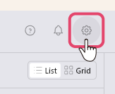
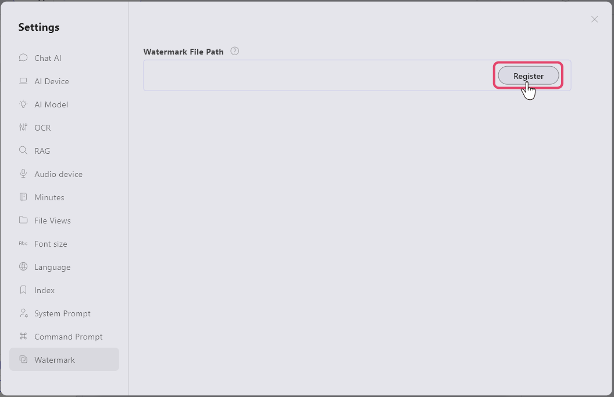
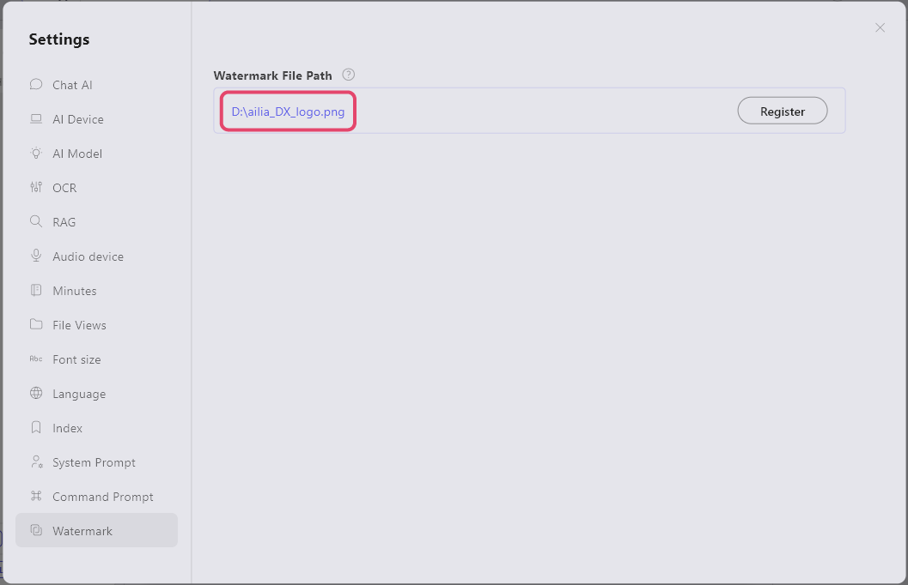
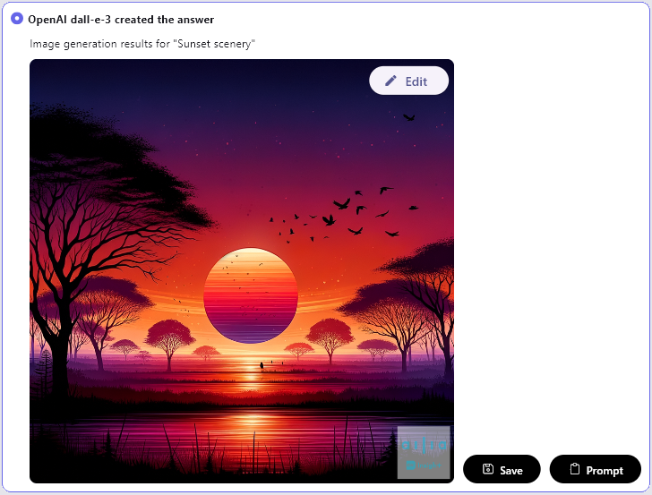

# 画像にウォーターマークを付ける
ailia DX Insightでは生成する画像に、ウォーターマークを手軽に追加することができます。

ここでは見本としてこちらのロゴマークを20％透過させた画像を使用します。

1. 画面右上にある歯車アイコンを押します。 

1. 「透かし画像」の項目内にある透かし画像ファイルパスの「登録」を選択し、表示されるエクスプローラー内にて使用する画像を選択します。 
 
1. ウォーターマークに使用する画像ファイルのディレクトリが表示されれば、設定は完了です。 
 

* 画像を生成すると、画像の右下にウォーターマークが追加されます。 
 